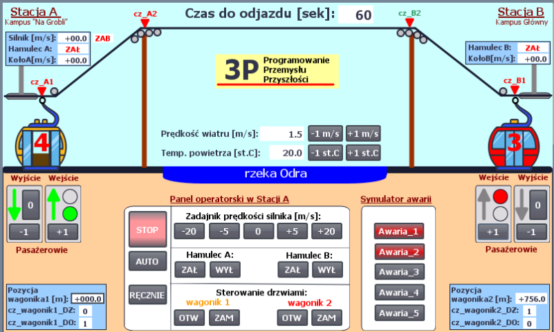

# 🚠 Cable Car "Polinka" PLC control system

Qualifications task of Mistrzostwa w Algorytmice i Programowaniu Przemysłu Przyszłości. Its successful completion gave us a way to finals of this competition, where we were one of the four awarded teams (we've received a distinction). The task was to provide control for cable car, creating automatic and manual mode + handling extra data from sensors.

## 📑 Technologies

-   PLC programming with TIA Portal
-   Siemens S1215C CPU
-   communication between PLCs via S7 communication protocol
-   task description: [zadanie_eliminacyjne.pdf](zadanie_eliminacyjne.pdf)

